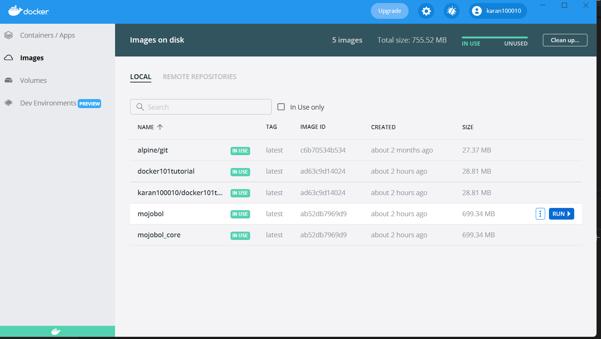

# mojoबोल
IVR platform that combines the best of as many worlds as possible. 

Mojबोल uses the work of the Swara (http://gitlab.com/mojolab/swara) platform to create a new engine that can read, 
interpret and play as an automated telephonic response, call flows made in Verboice Desinger (http://gitlab.com/instedd/verboice) 

The call flows can be designed and exported from http://verboice.com
Currently supported Verboice call flow steps are 

1. Play

2. Record

3. Menu

4. Key input (capture)


sh -c "$(curl -fsSL https://raw.github.com/mojolab/mojobol/fix-install/install.sh"


## Docker Installation

After cloning the repository, build the Docker image from the docker file. Once the image is built run it with the docker run command as follows

```
cd <mojobol source directory>
docker run -d -it --name mojobol --mount type=bind,source=$PWD,target=/opt/mojobol mojobol:latest

```
### Docker for windows

Step 1: After installing the docker image open docker in your windows desktop

Step 2: Click on run infront of the mojobol image



Step 3: Click on optional details after the pop up opens


Step 4:

In the host path column fill path to your mojobol repo or select the repo by clicking on the ... icon in the corner
in the container path column enter /opt/mojobol

.png)


## Installation Instructions

```
cd <mojobol directory>

docker compose up

docker run -d -it --name mojobol --mount type=bind,source=$PWD,target=/opt/mojobol mojobol_core:latest

```
### Install dependencies

```
# apt-get install lame asterisk  wget gcc g++ bison zlib1g openssl  python-setuptools espeak python-dev git
# easy_install oauth2
# easy_install pyyaml
```

### Install codebase

```
# cd /opt 
# git clone https://gitlab.com/mojolab/mojobol.git
# cd mojobol
# sudo ln -s /opt/mojobol/bin /usr/share/asterisk/agi-bin/mojobol

```


### Create server

Create a config file for the server as described in mojobol/conf/sampleserver.conf
Ensure that all paths mentioned in the server config file are created and writeable by asterisk

In /opt/mojobol/bin create a python executable file file as described in mojobol/bin/sample.py

### Configure Asterisk to run the call flow when called

Edit mojobol/conf/extensions.conf and ensure that the correct file is selected under the callback context

### Configure Asterisk to recieve calls from other SIP users 

The section titled [samplesipuser] in mojolab/conf/sip.conf is an example of how to add SIP users. These user ids can be used to configure a 
SIP softphone such as Blink or Twinkle to call in over VoIP, great for testing.


### Configure Asterisk to interface with a SIP Gateway
Different SIP Gateways work differently. The sample configuration under the section titled [matrix] in mojolab/conf/sip.conf is an example of how to add a Matrix SETU ATA 211G unit, the standard device we usually use for our installations


### Autoconfigure Asterisk

```
# cd mojobol
# sh setupasterisk.sh
```


### Create workflows

See video at https://www.youtube.com/watch?v=oK-tm1eF8Lc for instructions on how to make and export workflows from Verboice designer


### Install workflows

Extract the workflow zip file to a location accessible by asterisk user. Change the server configuration's workflow element to reflect the new path. Easy peasy :)


